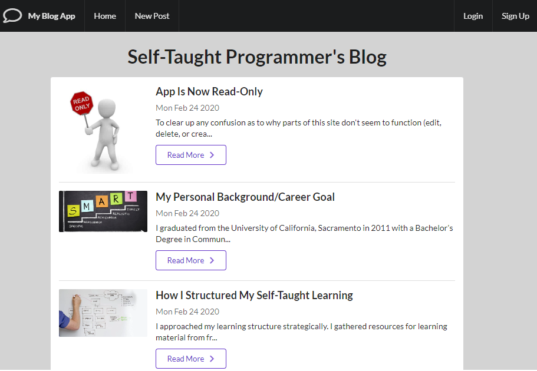

# BlogApp

### Purpose
Basic blog app allowing users to create an account and view, create, edit, and delete blog posts.

###### Please note
Updated blog app to currently be read-only for portfolio purposes. 

### Built Using
* HTML
  * With EJS
* CSS
  * Semantic UI
* JavaScript
* Express
  * Passport
  * Express Sessions
* Node
* MongoDB
  * Mongoose
  
### Features
* User account creation
* User sessions
* Full CRUD operations
* Authentication
* Responsive web design
* RESTful routing
* Custom schema models

